# fgz User Guide

Every fgz file starts with `fgz 1`. Positions are given in TikZ units, and the
generated snippets assume the LaTeX preamble already includes `\input{fgz.tikz.tex}`.

## Progressive Examples

### 1. Minimal Factor Graph

Start with two variables and a binary factor. Because the factor has no explicit
position, fgz places it halfway between the first two variables.


Source: [`guide-minimal.fgz`](./guide-minimal.fgz)

```fgz
fgz 1
variable x (0, 0)
variable y (3.5, 0)
factor {x, y}
```

### 2. Themes and Known Variables

Observed factor-graph variables use `known`. Factors can be positioned explicitly,
and the overall look can be changed with a file-level `theme`.


Source: [`guide-theme-known.fgz`](./guide-theme-known.fgz)

```fgz
fgz 1
theme textbook
known z (0, 0)
variable x (3.5, 0)
factor {z, x} (1.75, 1.75) shape=square
```

### 3. Factor Shape

Factors are circles by default. Add `shape=square` when you want a square factor node
instead.


Source: [`guide-factor-shape.fgz`](./guide-factor-shape.fgz)

```fgz
fgz 1
variable x (0, 0)
known y (3, 0)
factor {x, y} shape=square
```

### 4. Per-File Node and Factor Size

The `style` line tunes sizing for one fgz file at a time. Here it makes the
variables slightly larger and the factor slightly bolder, while also relaxing the
label fit.

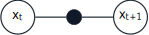

Source: [`guide-style-size.fgz`](./guide-style-size.fgz)

```fgz
fgz 1
style node_size=9mm factor_size=4mm label_sep=0.3pt label_font=small
variable x_t (0, 0)
variable x_{t+1} (3, 0)
factor {x_t, x_{t+1}}
```

### 5. Curved Binary Factors

For binary factors, a small `offset=(dx,dy)` moves the factor away from the midpoint
and bends the single factor-graph edge through that new factor position.

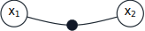

Source: [`guide-curved-binary-factor.fgz`](./guide-curved-binary-factor.fgz)

```fgz
fgz 1
variable x_1 (0, 0)
variable x_2 (3.5, 0)
factor {x_1, x_2} offset=(0,-0.35)
```

### 6. Factor-Graph Parents for Nodes

Mixed diagrams are allowed when factor-graph variables or knowns act as parents of
Bayes-net nodes. Nodes themselves do not participate in factors.

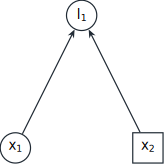

Source: [`guide-fg-parents-bn.fgz`](./guide-fg-parents-bn.fgz)

```fgz
fgz 1
variable x_1 (0, 0)
known x_2 (3.5, 0)
node l_1 {x_1, x_2} (1.75, 3.5)
```

### 7. Known Nodes and Directed Curve Overrides

Bayes-net declarations support both latent nodes and observed nodes. A directed
`curve` statement overrides one implied parent-to-child edge.

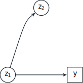

Source: [`guide-directed-curve.fgz`](./guide-directed-curve.fgz)

```fgz
fgz 1
node z_1 {} (0, 0)
known_node y {z_1} (3.5, 0)
node z_2 {z_1} (1.75, 3.5)
curve z_1 -> z_2 via (0.9, 2.8)
```

### 8. Color Accents

Colors apply to declarations and to their generated edges. This is useful for marking
active variables, measurements, or elimination steps.

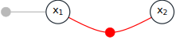

Source: [`guide-color-accents.fgz`](./guide-color-accents.fgz)

```fgz
fgz 1
variable x_1 (0, 0)
variable x_2 (3.5, 0)
factor {x_1, x_2} offset=(0,-0.7) color=red
factor {x_1} (-1.75, 0) color=gray!55
```

### 9. Macros for LaTeX Labels

Once the structure is clear, macros keep the source readable while emitting richer
math labels. References stay short in the graph definition, while the rendered labels
come from the macro table.


Source: [`guide-macros.fgz`](./guide-macros.fgz)

```fgz
fgz 1
u = u_t
x = x_t
l = \ell_t
known u (0, 0)
variable x (3.5, 0)
node l {x} (3.5, 3.5)
factor {u, x} (1.75, 1.75)
```

### 10. A Colored Chain Model

This example combines direct LaTeX-style labels, square factors, colors, and
higher-arity factors in a temporal chain. The red factors are positioned explicitly,
while the blue and green ternary factors rely on midpoint placement along their first
two variables. The document-level style line nudges node size, factor size, label
padding, and label font for this one figure without changing the shared TikZ support
file.

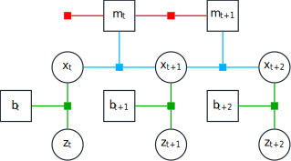

Source: [`guide-colored-chain.fgz`](./guide-colored-chain.fgz)

```fgz
fgz 1
style node_size=9mm factor_size=2mm label_sep=0.2pt label_font=small
variable x_t (0, 0)
variable x_{t+1} (3, 0)
variable x_{t+2} (6, 0)
variable z_t (0, -2.25)
variable z_{t+1} (3, -2.25)
variable z_{t+2} (6, -2.25)
known b_t (-1.5, -1.125)
known b_{t+1} (1.5, -1.125)
known b_{t+2} (4.5, -1.125)
known m_t (1.5, 1.5)
known m_{t+1} (4.5, 1.5)

factor {m_t} (0, 1.5) shape=square color=red
factor {m_t, m_{t+1}} shape=square color=red
factor {x_t, x_{t+1}, m_t} shape=square color=cyan!70!blue
factor {x_{t+1}, x_{t+2}, m_{t+1}} shape=square color=cyan!70!blue
factor {x_t, z_t, b_t} shape=square color=green!65!black
factor {x_{t+1}, z_{t+1}, b_{t+1}} shape=square color=green!65!black
factor {x_{t+2}, z_{t+2}, b_{t+2}} shape=square color=green!65!black
```

### 11. A Small Gray Bayes Net

This example uses the same spacing scale as the chain model, but with only directed
edges. Filled circular nodes highlight selected variables, while `known_node` gives a
square parent at the top right.

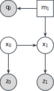

Source: [`guide-gray-bayes-net.fgz`](./guide-gray-bayes-net.fgz)

```fgz
fgz 1
style node_size=9mm factor_size=3mm label_sep=0.2pt label_font=small
node q_0 {m_1} (0, 2) color=gray!30
known_node m_1 {} (2, 2)
node x_0 {} (0, 0)
node x_1 {x_0, m_1} (2, 0)
node z_0 {x_0} (0, -2) color=gray!30
node z_1 {x_1} (2, -2) color=gray!30
```

### 12. A Compact Factor Graph

This one returns to pure factor-graph structure on the same grid. A known variable sits
above the midpoint factor, while square unary factors anchor the left and bottom edges.

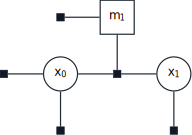

Source: [`guide-compact-factor-graph.fgz`](./guide-compact-factor-graph.fgz)

```fgz
fgz 1
style node_size=9mm factor_size=2mm label_sep=0.2pt label_font=small
variable x_0 (0, 0)
variable x_1 (3, 0)
known m_1 (1.5, 1.5)

factor {m_1} (0, 1.5) shape=square
factor {x_0} (-1.5, 0) shape=square
factor {x_0} (0, -1.5) shape=square
factor {x_0, x_1, m_1} shape=square
factor {x_1} (3, -1.5) shape=square
```

### 13. A Small Directed Triangle

This final compact example uses the same grid again, but only Bayes-net edges: the
square node at the top is a known parent of both variables, and the right variable also
parents the left one.


Source: [`guide-directed-triangle.fgz`](./guide-directed-triangle.fgz)

```fgz
fgz 1
style node_size=9mm factor_size=3mm label_sep=0.2pt label_font=small
known_node m_1 {} (1.5, 1.5)
node x_1 {m_1} (3, 0)
node x_0 {m_1, x_1} (0, 0)
```

### 14. Dashed and Labeled Bayes-Net Edges

The `edge` statement overrides one implied directed Bayes-net edge to add a dashed
style and a small label beside the arrow. Solid unlabeled edges still come directly
from the `node` and `known_node` parent lists.

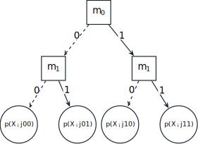

Source: [`guide-dashed-bayes-net.fgz`](./guide-dashed-bayes-net.fgz)

```fgz
fgz 1
style node_size=9mm label_sep=0.2pt

m_root = m_0
m_left = m_1
m_right = m_1
p_l0 = p(X_i|00)
p_l1 = p(X_i|01)
p_r0 = p(X_i|10)
p_r1 = p(X_i|11)

known_node m_root {} (3, 4.2)
known_node m_left {m_root} (1.3, 2.1)
known_node m_right {m_root} (4.7, 2.1)

node p_l0 {m_left} (0, 0) size=14mm font=scriptsize
node p_l1 {m_left} (2.2, 0) size=14mm font=scriptsize
node p_r0 {m_right} (3.8, 0) size=14mm font=scriptsize
node p_r1 {m_right} (6, 0) size=14mm font=scriptsize

edge m_root -> m_left style=dashed label=0 label_side=left label_pos=0.35
edge m_root -> m_right label=1 label_side=right label_pos=0.35
edge m_left -> p_l0 style=dashed label=0 label_side=left label_pos=0.35
edge m_left -> p_l1 label=1 label_side=right label_pos=0.35
edge m_right -> p_r0 style=dashed label=0 label_side=left label_pos=0.35
edge m_right -> p_r1 label=1 label_side=right label_pos=0.35
```

## Advanced Example

### Toy SLAM Elimination Sequence

This reconstruction starts from the original SLAM factor graph and then uses five more
fgz files to show the elimination sequence: unary and binary factors, color accents,
factor offsets, and the transition from factor-graph structure toward a Bayes net as
variables are eliminated.

<table>
  <tr>
    <td align="center">
      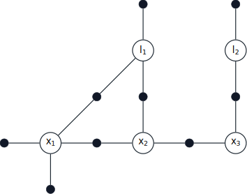<br>
      <strong>(a)</strong> Original factor graph.
    </td>
    <td align="center">
      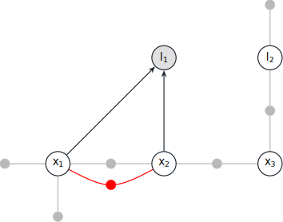<br>
      <strong>(b)</strong> Eliminate <code>l_1</code>.
    </td>
  </tr>
  <tr>
    <td align="center">
      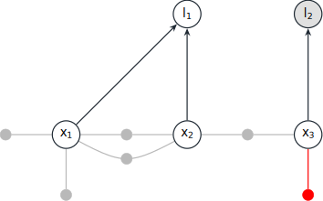<br>
      <strong>(c)</strong> Eliminate <code>l_2</code>.
    </td>
    <td align="center">
      <br>
      <strong>(d)</strong> Eliminate <code>x_1</code>.
    </td>
  </tr>
  <tr>
    <td align="center">
      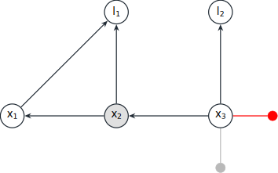<br>
      <strong>(e)</strong> Eliminate <code>x_2</code>.
    </td>
    <td align="center">
      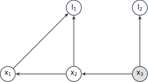<br>
      <strong>(f)</strong> Eliminate <code>x_3</code>.
    </td>
  </tr>
</table>

#### Source: `slam-original-factor-graph.fgz`

```fgz
fgz 1
theme classic

variable x_1 (0, 0)
variable x_2 (3.5, 0)
variable x_3 (7, 0)
variable l_1 (3.5, 3.5)
variable l_2 (7, 3.5)

factor {x_1} (-1.75, 0)
factor {x_1} (0, -1.75)
factor {x_1, x_2}
factor {x_2, x_3}
factor {x_1, l_1}
factor {x_2, l_1}
factor {x_3, l_2}
factor {l_1} (3.5, 5.25)
factor {l_2} (7, 5.25)
```

#### Source: `slam-eliminate-l1.fgz`

```fgz
fgz 1
theme classic

variable x_1 (0, 0)
variable x_2 (3.5, 0)
variable x_3 (7, 0)
node l_1 {x_1, x_2} (3.5, 3.5) color=gray!25
variable l_2 (7, 3.5)

factor {x_1} (-1.75, 0) color=gray!55
factor {x_1} (0, -1.75) color=gray!55
factor {x_1, x_2} color=gray!55
factor {x_1, x_2} offset=(0,-0.7) color=red
factor {x_2, x_3} color=gray!55
factor {x_3, l_2} color=gray!55
factor {l_2} (7, 5.25) color=gray!55
```

#### Source: `slam-eliminate-l2.fgz`

```fgz
fgz 1
theme classic

variable x_1 (0, 0)
variable x_2 (3.5, 0)
variable x_3 (7, 0)
node l_1 {x_1, x_2} (3.5, 3.5)
node l_2 {x_3} (7, 3.5) color=gray!25

factor {x_1} (-1.75, 0) color=gray!55
factor {x_1} (0, -1.75) color=gray!55
factor {x_1, x_2} color=gray!55
factor {x_1, x_2} offset=(0,-0.7) color=gray!55
factor {x_2, x_3} color=gray!55
factor {x_3} (7, -1.75) color=red
```

#### Source: `slam-eliminate-x1.fgz`

```fgz
fgz 1
theme classic

node x_1 {x_2} (0, 0) color=gray!25
variable x_2 (3.5, 0)
variable x_3 (7, 0)
node l_1 {x_1, x_2} (3.5, 3.5)
node l_2 {x_3} (7, 3.5)

factor {x_2} (3.5, -1.75) color=red
factor {x_2, x_3} color=gray!55
factor {x_3} (7, -1.75) color=gray!55
```

#### Source: `slam-eliminate-x2.fgz`

```fgz
fgz 1
theme classic

node x_1 {x_2} (0, 0)
node x_2 {x_3} (3.5, 0) color=gray!25
variable x_3 (7, 0)
node l_1 {x_1, x_2} (3.5, 3.5)
node l_2 {x_3} (7, 3.5)

factor {x_3} (8.75, 0) color=red
factor {x_3} (7, -1.75) color=gray!55
```

#### Source: `slam-eliminate-x3.fgz`

```fgz
fgz 1
theme classic

node x_1 {x_2} (0, 0)
node x_2 {x_3} (3.5, 0)
node x_3 {} (7, 0) color=gray!25
node l_1 {x_1, x_2} (3.5, 3.5)
node l_2 {x_3} (7, 3.5)
```
